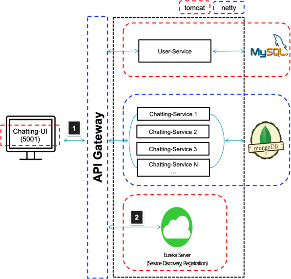

# han_demand
- [링크](https://okky.kr/article/423650)

# 실행 순서
1. Discovery-Service
2. Gateway-Service
3. User-Service
4. Chatting-Service
5. Chatting-UI

# Software Architecture

# Work-Flow
- 모든 클라이언트의 요청은 API-Gateway에서 받는다.
- API-Gateway는 Discovery-Service를 조회하여 마이크로 서비스의 위치를 찾아 요청한다.
- User-Service에서 JWT를 통한 인증 및 인가, 유저정보를 조회한다.
- Chatting-Service에서 채팅 기능이 동작한다.

# discovcery-service
- Spring Cloud Netflix Eureka 서버로 구성
- service-discovery의 역할
  - 각 MSA(Microsoft Application)은 Eureka Server에 Registration하며, API Gateway에서는 Eureka Server를 통해 서비스를 Discovery 한다.
- 부하 분산(load balancing) 기능 수행
  - 기본적으로 Round-Robin방식으로 동작(시분할 처리). 변경 가능.
  - [링크](https://docs.spring.io/spring-cloud-commons/docs/current/reference/html/#switching-between-the-load-balancing-algorithms)

# api-gateway
- Webflux로 구성
- 인증 및 권한 부여 공통처리
  - 헤더의 JWT를 확인한다.
- 서비스 검색 통합
  - Client는 API-Gateway로 요청하면, discovery-service를 통해 마이크로 서비스의 위치를 찾고, 호출한다.

# user-service

- spring-security 기반의 JWT 인증 및 인가를 처리.

# chatting-service

- 채팅 기능의 동작

# 공개용 API 및 인증 사용자용 API 구분

- 공개용 API
  - 로그인: /api/users/login

- 인증 사용자용 API
  - 내 정보 조회: /api/users/me
  - 채팅 api 호출: /api/chat/*
